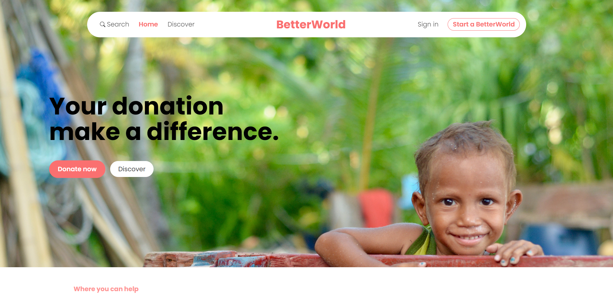
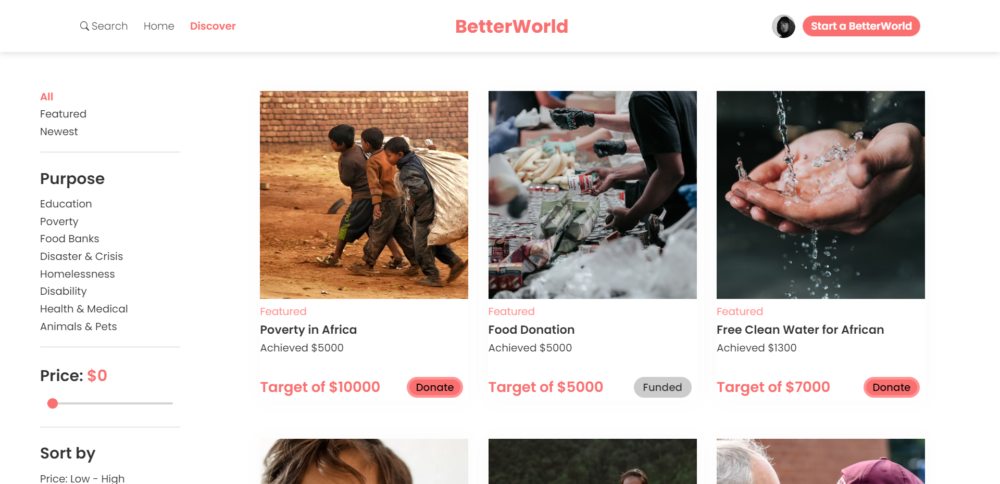
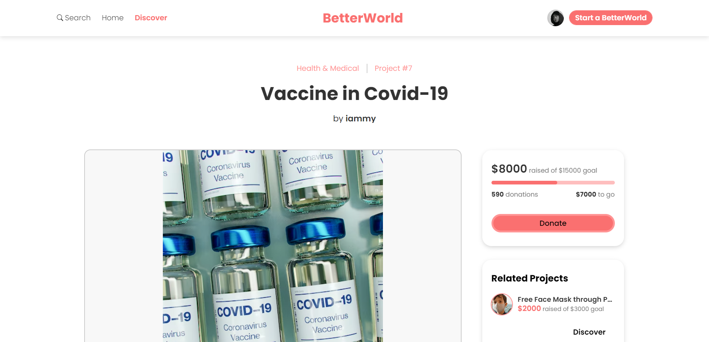
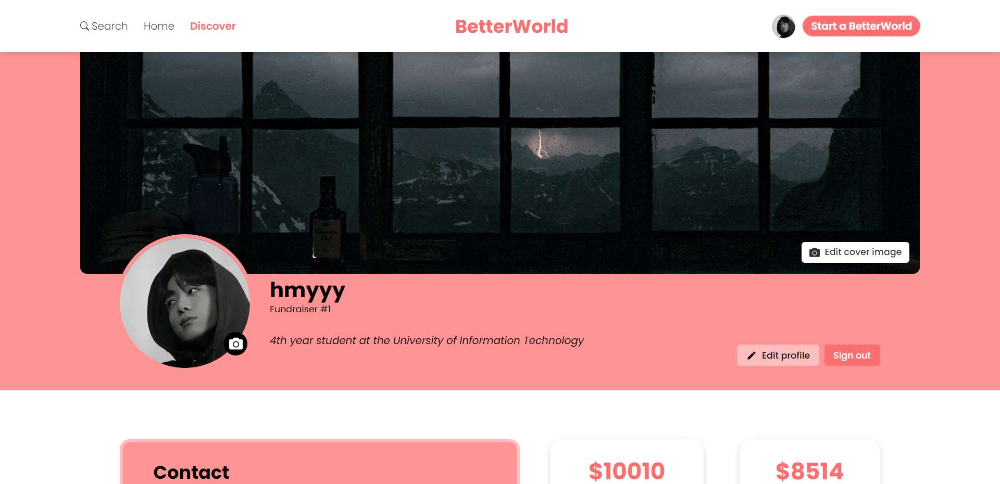

# BetterWorld: Donation and Fundraising Platform with React

This is a website for people to donate and fundraise made with React 

[Check out test production](https://betterworld-9e2l0b70s-nhm204.vercel.app/)

**Note: The test production does not use data from the backend. If you want to use the backend data, git clone this** [Backend](https://github.com/nhatminhne/betterworld_doan.git)

## Registration Page

Register using username, phone number, email and password must contain between 8 and 60 characters with no whitespace, at least 1 uppercase and lowercase letter, as well as 1 number and symbol

## Login Page

Login using username and password, check the checkbox to remember your account

## Homepage

### `Donate now button`

When you click the "Donate now" button, a random featured project will be displayed.

### `Dropdown Search`

- Search projects by name and category
- Display recent search results

### `See some featured projects`

## Discover Page

View all campaigns and featured projects will always come before non-featured projects

### `Filter bar`

- Filter projects by:
  + Category
  + Newest
  + Featured
  + Target price

- Sort projects by:
  + Price from low to high and vice versa
  + Name from A to Z and vice versa
  + Reset sort by clicking on "Reset" button

**Note: Featured projects will always come before non-featured projects regardless of sorting**

## Create Project by clicking on "Start a BetterWorld" button

- Project name, image, category, target price and description is required. You can choose an existing image from your device or pass a link to the image

- Pay 5 dollars fee to feature fundraiser through PayPal or using Visa, Credit Card.

- If you checked the feature checkbox make sure that you have pay the fee before submit to create your fundraiser

**Note: Featured project checkbox is not required but if you checked it, keeps in mind that this will charge you 5 dollars fee to feature your fundraiser.**

**Note: You can edit your project later. If your project is not feature, you can edit project to feature it**

## Project Details

- Display project details such as name, category, image, description, target price, current donated price and donations (the number of people who donated to the project)

- See related projects (generic projects)

- When clicking on "Donate" button, it will navigate you to the checkout page

- If the project is create by yourself, "Donate" button will change to "Edit project" button

## Checkout Page

- You have to login before donate to a fundraiser

- Enter the amount you want to donate and the amount must be over 1 USD and the amount also needs to be less than or equal to the amount the project needs to reach the target

- Checkout using PayPal or Visa, Credit Card

**Note: You cannot donate to project create by yourself**

## Personal/Fundraiser Profile Page

### `Fundraiser Profile Page`

- Avatar, background cover, and username will be displayed as well as contact information and projects created by the fundraiser

- The fundraiser's credibility will also be verified through the number of campaigns the fundraiser has successfully raised and the number of projects donated by this person

### `Personal Profile Page`

- You can edit your information, as well as your avatar and background cover can be cropped

- View donation history including project name, amount donated and transaction date
